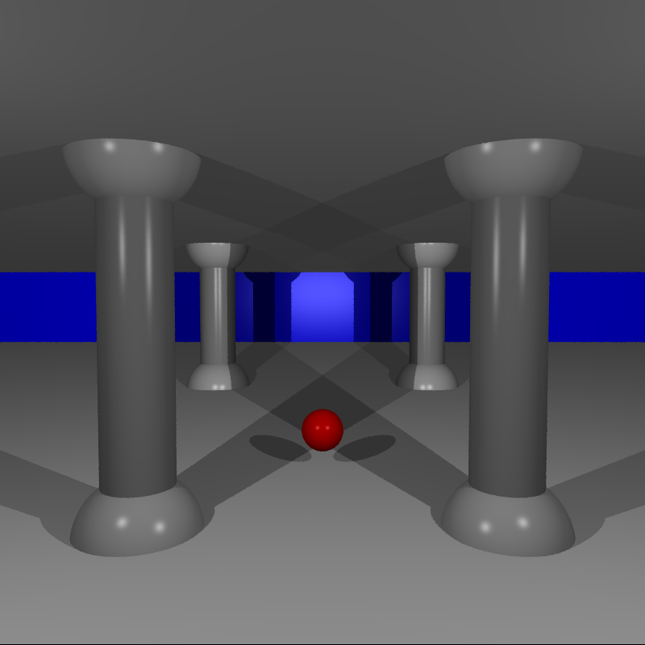
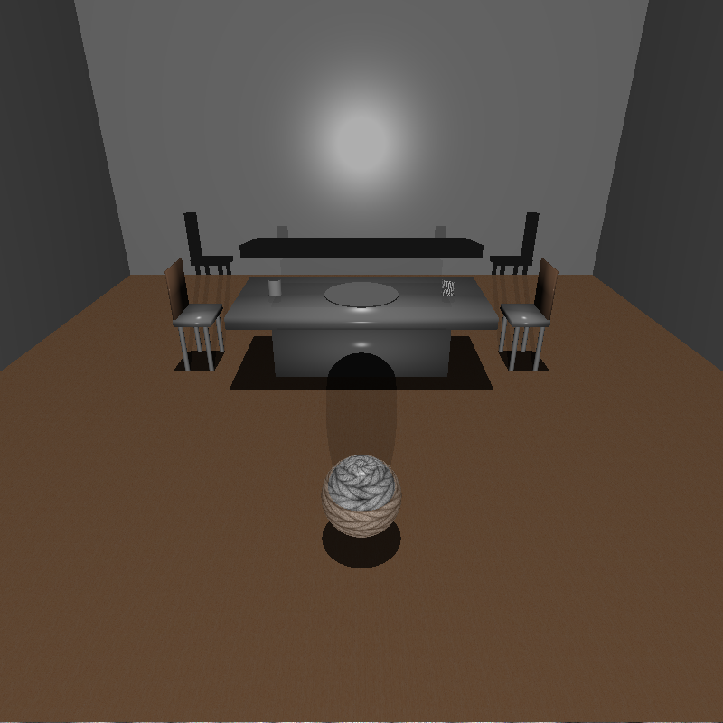
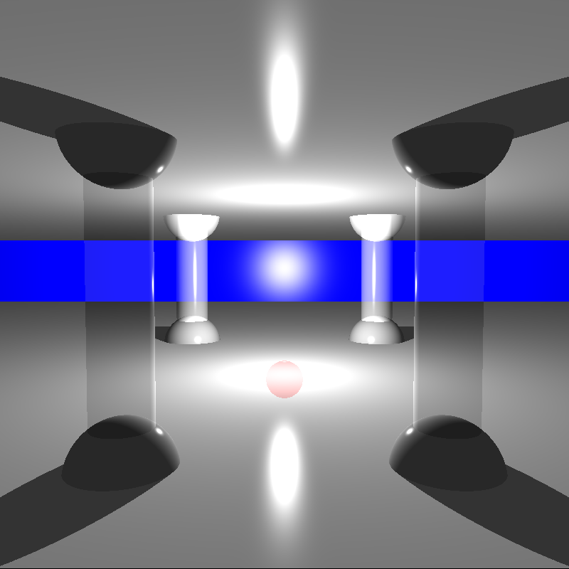
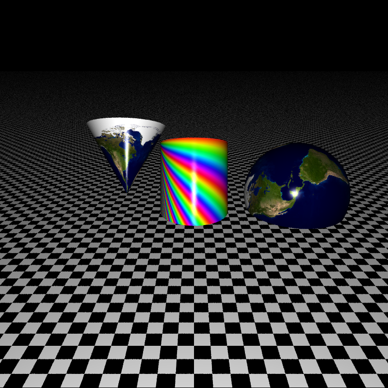
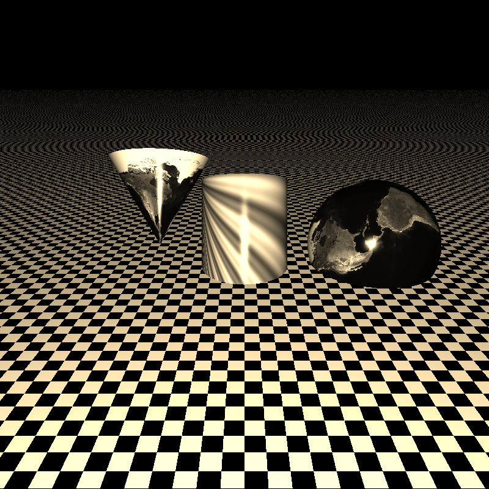
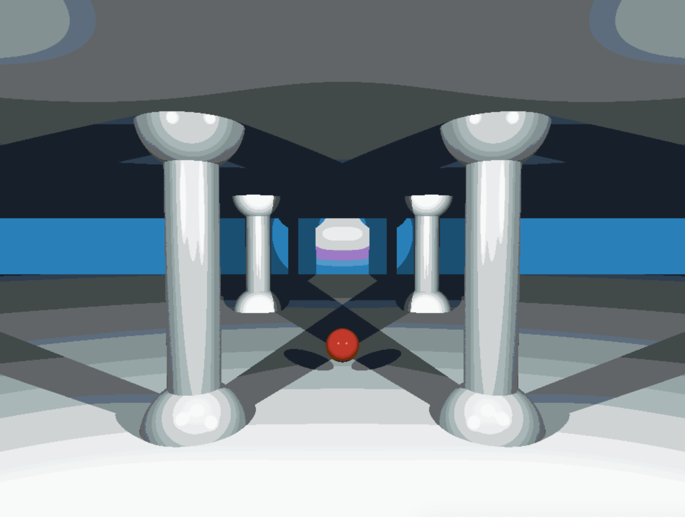
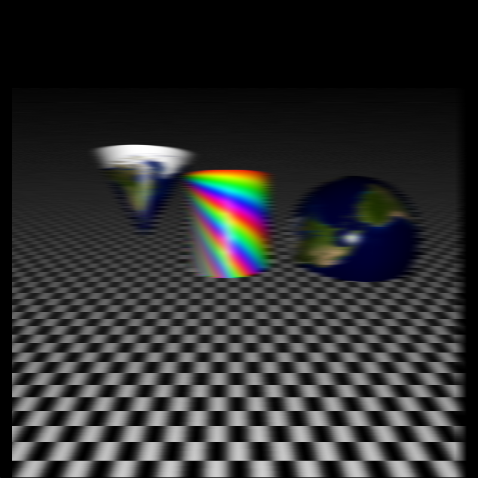
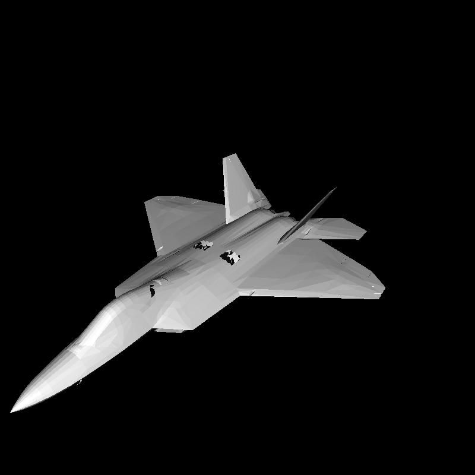

# Rt
générer des images de synthèse selon la méthode du Ray-Tracing. Ces images de synthèse représentent une scène, vue d’une position et d’un angle spécifiques, définie par des objets géométriques simples, entiers ou partiels, et disposant d’un système d’éclairage.

## Installing
####  install SDL2.<br>
- Linux :
```
$ sudo apt install libsdl2-2.0-0 libsdl2-gfx-1.0-0 libsdl2-image-2.0-0 libsdl2-mixer-2.0-0 libsdl2-net-2.0-0 libsdl2-ttf-2.0-0
```
- Mac _(takes time)_ :
```
$ brew install sdl2 sdl2_image sdl2_ttf
```
Then run :
```
$ make
```
## Compiling

Use [make](https://en.wikipedia.org/wiki/Makefile) for compiling all files.

When you have already installed SDL2 library you can use this simple rules:
- **make**: Compile all.
- **make clean**: Delete temporary files.
- **make fclean**: Delete executable Rt file & libft.
- **make re**: It's rules - **make fclean** & **make** in one.
## Usage
The programm takes a scene written in xml as an argument. Multiple **scenes** are directly available in the directory "./scenes2/" .
```
$ ./rt 'file_name'
```
- save flag

```
$ ./rt 'file_name' --save
```
### if you have more then 1 camera in the scene
- `[o | p]`: Moving camera forward | Moving camera backward.
- `[f | g]`: stretch texture | stretch back texture.
- `[h | j]`: shift texture to right | shift texture to left.

## Features
### Basics
- 4 objects : sphere, plane, cylinder, cone
- Multiple light sources
- Phong shading
- Shadows
- Translations & rotations (camera & objects)

# 

### Limited objects
- Each object can be cut on 3 different axes
- These 3 axes can be either the world axes or the object axes
- Translations & rotations are still working with cut objects
- Planes can either be cut into rectangles or circles

### Textures
- Each object can have a texture put on it
- Variable scale & position
- Can use alpha channel to set the transparency of the object
- Can size the object (sets its limits)
- 24 bits & 32 bits images support
# 
### Refraction / Reflection
- Both have adjustable percentages
- Implementation of Snell-Descartes's indice of refraction
- A semi-transparent object has its colors projected in its shadow
- Checkerboard / rainbow
# 
# 

### User Interface
- hover effect

### Visual effects
- Anti-aliasing
- Sepia & grey filters
- Stereoscopy
- blur
- cartoon
# 

# 

### Lights
- Direct & parallel lights
- Colored lights
- multi lights
- ambient %

# 

### Optimization
- Pixelation
- Multi-threading


